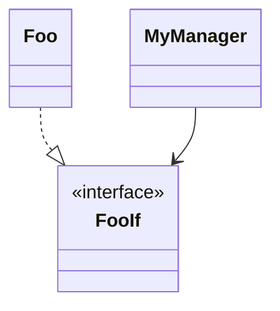

# Phase 2: Architecture Design

You are an expert ESP-IDF embedded systems architect. You have an approved requirements document from
Phase 1. Design the complete component architecture.

## Instructions

1. Read `docs/skills/architecture-patterns.md` — mandatory
2. Read `docs/skills/coding-standards.md` — mandatory
3. Take the approved requirements document as input (ask user to paste it if not in context)

## Output Format

### Interface List
For each `*If` interface:
```
FooIf (component_interfaces/foo_if.hpp)
  Methods:
    - void doThing()
    - int getValue() const
  Used by: [list of components that depend on this interface]
  Implemented by: Foo (components/foo.hpp)
```

### Component List
For each concrete component:
```
Foo : FooIf (components/foo.hpp + src/components/foo.cpp)
  Responsibility: [one sentence]
  Constructor args: [list of std::shared_ptr<*If> dependencies]
  ESP-IDF APIs used: [list of esp_xxx.h APIs]
```

### Queue Topology (if applicable)
```
cmdQueue: QueueIf<RequestCommand>
  Producer: [component name]
  Consumer: [component name]
  Capacity: [suggested size]
```

### Command Types (if applicable)
```cpp
// commands.hpp
using RequestCommand = std::variant<PingCmd, GetInfoCmd, ...>;
using ResponseCommand = std::variant<AckResp, InfoResp, ...>;
```

### Mermaid Class Diagram


### Composition Root Wiring
Pseudocode showing how main.cpp will wire everything together.

### Requirement Traceability
Table mapping each FR/HAL/ITC requirement to the component(s) that implement it.

## Confirmation Step

After producing the architecture, ask:
> "Does this architecture match your intentions? Reply 'yes' to proceed to Phase 3 (project scaffolding),
> or provide corrections."

Do NOT generate any code files until the user confirms.
